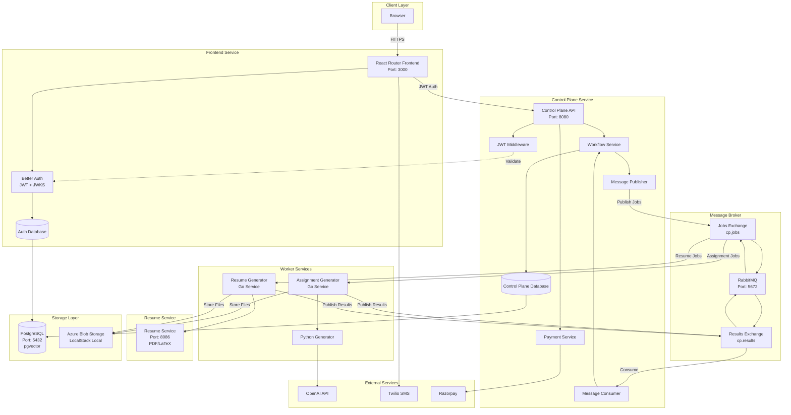

# Studojo v2 Architecture

## System Overview

Studojo v2 is a microservices-based platform for student productivity tools, with a focus on assignment generation, resume building, and study aids.

## Architecture Diagram



## Component Details

### Frontend Service
- **Technology**: React Router v7, Vite, TypeScript, TailwindCSS
- **Authentication**: Better Auth with JWT, phone OTP, Google OAuth, Passkeys
- **Database**: PostgreSQL (auth schema: user, session, account, etc.)
- **Responsibilities**:
  - User interface and interactions
  - Authentication and session management
  - User onboarding flow
  - Job submission and status polling
  - Interactive assignment generation flow
  - Resume building and management (Careers Dojo)
  - Payment integration (Razorpay checkout)

### Control Plane
- **Technology**: Go 1.23
- **Responsibilities**:
  - Authentication/authorization (JWT validation via JWKS)
  - Job lifecycle management (CREATED → QUEUED → RUNNING → COMPLETED | FAILED)
  - Idempotency handling
  - State persistence
  - Result event processing
  - Payment management (Razorpay integration)
  - Payment verification and job linking
- **API Endpoints**:
  - `POST /v1/jobs` - Submit job (assignment-gen, resume-gen, resume-optimize)
  - `POST /v1/outlines/generate` - Generate assignment outline (free)
  - `POST /v1/outlines/edit` - Edit assignment outline (free)
  - `GET /v1/jobs` - List jobs
  - `GET /v1/jobs/:id` - Get job status
  - `POST /v1/payments/create-order` - Create payment order
  - `POST /v1/payments/verify` - Verify payment signature
  - `GET /health` - Liveness
  - `GET /ready` - Readiness

### Assignment Gen Worker
- **Technology**: Go 1.23
- **Responsibilities**:
  - Consume jobs from RabbitMQ (`assignment-gen.jobs` queue)
  - Handle `assignment-gen`, `outline-gen`, and `outline-edit` job types
  - Invoke Python assignment generator
  - Upload generated documents to Azure Blob Storage (for assignment-gen)
  - Publish result events to RabbitMQ

### Resume Worker
- **Technology**: Go 1.23
- **Responsibilities**:
  - Consume jobs from RabbitMQ (`resume.jobs` queue)
  - Handle `resume-gen` jobs: Generate package (Resume, Cover Letter, CV)
  - Handle `resume-optimize` jobs: Optimize resume for specific job postings
  - Call Resume Service for PDF/package generation
  - Upload generated files to Azure Blob Storage (for resume-gen)
  - Publish result events to RabbitMQ

### Resume Service
- **Technology**: Go 1.25+
- **Port**: 8086
- **Responsibilities**:
  - Generate resume PDFs from JSON
  - Generate resume packages (ZIP with Resume, Cover Letter, CV)
  - Optimize resumes based on job descriptions
  - LaTeX-based PDF generation
- **API Endpoints**:
  - `POST /make-resume` - Generate PDF from resume JSON
  - `POST /generate-package` - Generate ZIP package with Resume, Cover Letter, CV
  - `POST /optimize-resume` - Optimize resume for job posting
  - `GET /health` - Health check

### Python Assignment Generator
- **Technology**: Python 3.13, LangChain, LangGraph
- **Responsibilities**:
  - Interactive input collection
  - Outline generation and editing
  - Content generation with LLM
  - Document formatting (DOCX)
  - Humanization and uniqueness checking

## Message Flow

1. **Assignment Job Submission**:
   ```
   Frontend → Control Plane API → Payment Verification → RabbitMQ (cp.jobs/job.assignment-gen)
   ```

2. **Outline Generation/Editing**:
   ```
   Frontend → Control Plane API → RabbitMQ (cp.jobs/job.outline-gen or job.outline-edit)
   ```

3. **Assignment Job Processing**:
   ```
   RabbitMQ → Assignment Worker → Python Generator → OpenAI → Blob Storage
   ```

4. **Assignment Result Delivery**:
   ```
   Assignment Worker → RabbitMQ (cp.results/result.*) → Control Plane → Frontend (polling)
   ```

5. **Resume Job Submission**:
   ```
   Frontend → Control Plane API → RabbitMQ (cp.jobs/job.resume-gen or job.resume-optimize)
   ```

6. **Resume Job Processing**:
   ```
   RabbitMQ → Resume Worker → Resume Service → Blob Storage (for resume-gen)
   RabbitMQ → Resume Worker → Resume Service (for resume-optimize)
   ```

7. **Resume Result Delivery**:
   ```
   Resume Worker → RabbitMQ (cp.results/result.resume-gen or result.resume-optimize) → Control Plane → Frontend (polling)
   ```

8. **Payment Flow**:
   ```
   Frontend → Control Plane (create order) → Razorpay Checkout → Frontend → Control Plane (verify) → Link to Job
   ```

## Data Flow

### Job Types

1. **assignment-gen**: Full assignment generation (paid, requires payment verification)
   - Generates complete assignment document (DOCX)
   - Requires payment before job creation
   - Result: download_url to assignment.docx

2. **outline-gen**: Assignment outline generation (free)
   - Generates assignment outline from description
   - No payment required
   - Result: outline JSON

3. **outline-edit**: Assignment outline editing (free)
   - Edits existing outline based on user chat messages
   - No payment required
   - Result: updated outline JSON

4. **resume-gen**: Resume generation (free)
   - Generates package (Resume, Cover Letter, CV) from resume JSON
   - Result: download_url to resume-package.zip

5. **resume-optimize**: Resume optimization (free)
   - Optimizes resume for specific job posting
   - Returns optimized resume JSON
   - Result: optimized resume JSON

### Job Lifecycle
1. User submits job request via frontend
2. For paid jobs (assignment-gen), payment is verified first
3. Control plane creates job record (status: CREATED)
4. Control plane enqueues job to RabbitMQ (status: QUEUED)
5. Worker consumes job, starts processing (status: RUNNING - implicit)
6. Worker processes job (generates content, optimizes, etc.)
7. For file-generating jobs, files are uploaded to blob storage
8. Worker publishes result event (status: COMPLETED)
9. Control plane updates job with result (download_url or data)
10. Frontend polls and displays result

### Storage
- **PostgreSQL**: 
  - `cp.*` schema: jobs, job_state_transitions, idempotency_keys, payments
  - `public.*` schema: user, session, account (auth), resumes (user-saved resumes)
- **Azure Blob Storage** (LocalStack for local):
  - Container: `assignments`
    - Path: `{job_id}/assignment.docx`
  - Container: `resumes`
    - Path: `{job_id}/resume-package.zip`
  - URLs: SAS tokens (Azure) or public URLs (LocalStack)

## Environment Configuration

### Frontend
- `VITE_CONTROL_PLANE_URL`: Control plane API URL
- `DATABASE_URL`: PostgreSQL connection
- `BETTER_AUTH_SECRET`: JWT signing secret
- `GOOGLE_CLIENT_ID`, `GOOGLE_CLIENT_SECRET`: OAuth
- `TWILIO_*`: SMS OTP

### Control Plane
- `DATABASE_URL`: PostgreSQL connection
- `RABBITMQ_URL`: RabbitMQ connection
- `JWKS_URL`: Frontend JWKS endpoint
- `CORS_ORIGINS`: Allowed origins
- `RAZORPAY_KEY_ID`: Razorpay API key ID
- `RAZORPAY_KEY_SECRET`: Razorpay API key secret (for signature verification)

### Assignment Gen Worker
- `RABBITMQ_URL`: RabbitMQ connection
- `RESULTS_EXCHANGE`: Results exchange name
- `USE_LOCALSTACK`: Use LocalStack (true/false)
- `LOCALSTACK_ENDPOINT`: LocalStack endpoint URL
- `AZURE_STORAGE_ACCOUNT_NAME`, `AZURE_STORAGE_ACCOUNT_KEY`: Blob storage credentials
- `AZURE_STORAGE_CONTAINER_NAME`: Container name (default: `assignments`)
- `OPENAI_API_KEY`: OpenAI API key
- `ANTHROPIC_API_KEY`: Anthropic API key
- `REPHRASY_API_KEY`: Rephrasy API key
- `PYTHON_PATH`: Python executable path
- `ASSIGNMENT_GEN_SCRIPT_PATH`: Path to Python assignment generator script

### Resume Worker
- `RABBITMQ_URL`: RabbitMQ connection
- `RESULTS_EXCHANGE`: Results exchange name
- `USE_LOCALSTACK`: Use LocalStack (true/false)
- `LOCALSTACK_ENDPOINT`: LocalStack endpoint URL
- `AZURE_STORAGE_ACCOUNT_NAME`, `AZURE_STORAGE_ACCOUNT_KEY`: Blob storage credentials
- `AZURE_STORAGE_CONTAINER_NAME`: Container name (default: `resumes`)
- `RESUME_SERVICE_URL`: Resume service endpoint (default: `http://resume-service:8086`)

### Resume Service
- `PORT`: HTTP port (default: `8086`)

## Deployment

All services are containerized and orchestrated via Docker Compose:

- **postgres**: pgvector/pg16
- **rabbitmq**: Latest
- **localstack**: Azure services emulation (S3)
- **frontend**: Node/Bun-based React app
- **frontend-db-push**: Database migration runner (one-time)
- **control-plane**: Go service
- **assignment-gen**: Python service
- **assignment-gen-worker**: Go worker
- **resume-service**: Go service (resume PDF/package generation)
- **resume-worker**: Go worker (resume job processing)
- **adminer**: Database admin UI (Port: 8081)

## Security

- JWT-based authentication between frontend and control plane
- JWKS endpoint for token validation
- User-scoped job access (authorization)
- Idempotency keys prevent duplicate submissions
- CORS protection on control plane API
- Payment signature verification (Razorpay HMAC SHA256)
- Payment-to-job linking prevents payment reuse
- Payment verification required for paid jobs (assignment-gen)
