# Studojo v2 Architecture

## System Overview

Studojo v2 is a microservices-based platform for student productivity tools, with a focus on assignment generation, resume building, and study aids. The system is built using modern technologies with clear separation of concerns, asynchronous job processing, and scalable architecture patterns.

### Key Features

- **AI-Powered Assignment Generation**: Interactive assignment creation with outline generation and editing
- **Resume Building & Optimization**: Complete resume package generation (Resume, Cover Letter, CV) with job-specific optimization
- **Document Humanization**: Structure-preserving document humanization service for assignment content
- **Blog Management**: Rich text blog editor (Maverick) for content management
- **Admin Panel**: User management, dissertation submissions, and career applications
- **Dev Panel**: Developer monitoring, telemetry, CI/CD status, and live log streaming
- **Partner Panel**: Partner management interface for company partners
- **Payment Integration**: Razorpay integration for paid services
- **Multi-Authentication**: JWT, phone OTP, Google OAuth, and Passkeys support
- **Email Notifications**: Transactional emails via Azure Communication Services with user preferences
- **Observability**: Azure Monitor integration, Kubernetes log streaming, and telemetry tracking

## Repository Structure

```
studojo/
├── apps/                          # Frontend applications
│   ├── frontend/                  # Main React Router application (Port: 3000)
│   │   ├── app/
│   │   │   ├── components/       # React components (auth, blog, careers, dojos, resumes)
│   │   │   ├── lib/              # Utilities (auth, control-plane, payments, db)
│   │   │   └── routes/           # Route handlers (40+ routes)
│   │   ├── drizzle/              # Database migrations
│   │   ├── public/               # Static assets
│   │   └── Dockerfile
│   ├── admin-panel/              # Admin interface (Port: 3001)
│   │   ├── app/
│   │   │   ├── components/       # Admin components
│   │   │   ├── lib/              # API clients and auth
│   │   │   └── routes/           # Admin routes (dashboard, users, dissertations, careers)
│   │   └── Dockerfile
│   ├── dev-panel/                # Developer monitoring panel (Port: 3004)
│   │   ├── app/
│   │   │   ├── components/       # Monitoring components
│   │   │   ├── lib/              # API clients and auth
│   │   │   └── routes/           # Dev routes (services, logs, metrics, ci-cd)
│   │   └── Dockerfile
│   ├── maverick/                 # Blog editor (Port: 3002)
│   │   ├── app/
│   │   │   ├── components/       # Blog and internship components
│   │   │   ├── lib/              # Blob storage, auth, DB utilities
│   │   │   └── routes/           # Blog and internship routes
│   │   └── Dockerfile
│   └── partner-panel/            # Partner management interface (Port: 3003)
│       ├── app/
│       │   ├── components/       # Partner components
│       │   ├── lib/              # API clients and auth
│       │   └── routes/           # Partner routes
│       └── Dockerfile
│
├── services/                      # Backend microservices
│   ├── control-plane/            # Central orchestration service (Port: 8080)
│   │   ├── cmd/server/           # Main entry point
│   │   ├── internal/
│   │   │   ├── api/              # HTTP handlers and middleware
│   │   │   ├── auth/             # JWT validation and JWKS
│   │   │   ├── messaging/       # RabbitMQ publisher/consumer
│   │   │   ├── store/            # Database store and migrations
│   │   │   └── workflow/         # Job lifecycle management
│   │   └── Dockerfile
│   ├── assignment-gen/           # Python assignment generator
│   │   ├── src/
│   │   │   ├── chains/           # LangChain/LangGraph workflows
│   │   │   ├── models/           # Data models
│   │   │   ├── tools/            # LLM tools and utilities
│   │   │   └── utils/            # Helper functions
│   │   ├── worker_generate.py    # Main generation worker
│   │   ├── worker_generate_outline.py
│   │   ├── worker_edit_outline.py
│   │   └── Dockerfile
│   ├── assignment-gen-worker/   # Go worker for assignment jobs
│   │   ├── cmd/worker/           # Worker entry point
│   │   ├── internal/
│   │   │   ├── blob/             # Azure Blob Storage client
│   │   │   ├── generator/        # Python generator invoker
│   │   │   └── messaging/       # RabbitMQ consumer
│   │   └── Dockerfile
│   ├── resume-svc/               # Resume PDF generation service (Port: 8086)
│   │   ├── cmd/server/           # Service entry point
│   │   ├── internal/
│   │   │   ├── domain/           # Domain models
│   │   │   ├── handler/          # HTTP handlers
│   │   │   └── tex/              # LaTeX generation
│   │   ├── templates/            # LaTeX templates
│   │   └── Dockerfile
│   ├── resume-worker/            # Go worker for resume jobs
│   │   ├── cmd/worker/           # Worker entry point
│   │   ├── internal/
│   │   │   ├── blob/             # Azure Blob Storage client
│   │   │   └── resume/           # Resume service client
│   │   └── Dockerfile
│   ├── humanizer-svc/            # Document humanization service (Port: 8000)
│   │   ├── app.py                # FastAPI application
│   │   ├── src/                  # Humanization pipeline
│   │   │   ├── pipeline.py       # Main pipeline
│   │   │   ├── paragraph_humanizer.py
│   │   │   └── ...
│   │   └── Dockerfile
│   ├── humanizer-worker/         # Go worker for humanization jobs
│   │   ├── cmd/worker/           # Worker entry point
│   │   ├── internal/
│   │   │   ├── blob/             # Azure Blob Storage client
│   │   │   └── humanizer/        # Humanizer service client
│   │   └── Dockerfile
│   └── emailer-service/          # Email service (Port: 8087)
│       ├── cmd/server/           # Service entry point
│       ├── internal/
│       │   ├── auth/             # Password reset token management
│       │   ├── email/            # Azure Email client and templates
│       │   ├── handlers/         # HTTP and event handlers
│       │   ├── messaging/       # RabbitMQ consumer/publisher
│       │   └── store/            # Database store
│       ├── templates/            # HTML email templates
│       └── Dockerfile
│
├── k8s/                          # Kubernetes deployment configs
│   ├── admin-panel/              # Admin panel deployment
│   ├── assignment-gen-worker/   # Assignment worker deployment
│   ├── azure-monitor/            # Azure Monitor daemonset and config
│   ├── cert-manager/             # SSL certificate management
│   ├── configmaps/               # Configuration maps
│   ├── control-plane/            # Control plane deployment
│   ├── dev-panel/                # Dev panel deployment
│   ├── emailer-service/          # Emailer service deployment
│   ├── frontend/                 # Frontend deployment and DB migration jobs
│   ├── humanizer-svc/            # Humanizer service deployment (HPA, PDB)
│   ├── humanizer-worker/         # Humanizer worker deployment
│   ├── ingress/                  # Ingress configuration
│   ├── maverick/                 # Maverick deployment and migration jobs
│   ├── partner-panel/            # Partner panel deployment
│   ├── postgresql/               # PostgreSQL deployment and backup
│   ├── rabbitmq/                 # RabbitMQ deployment
│   ├── redis/                    # Redis deployment
│   ├── resume-service/           # Resume service deployment (HPA)
│   ├── resume-worker/            # Resume worker deployment
│   ├── secrets/                  # Secret templates
│   └── deploy.sh                 # Deployment script
│
├── docker/                       # Docker setup scripts
│   ├── localstack-init.sh        # LocalStack initialization
│   └── postgres/                 # PostgreSQL init scripts
│
├── scripts/                      # Utility scripts
│   ├── port-forward-postgres.sh  # Port forwarding utilities
│   ├── port-forward-postgres-bg.sh
│   └── set-admin-user.sh         # Admin user setup
│
├── data/                         # Data files
│   ├── blog-images/              # Blog post images
│   └── studojo.blog_posts.json   # Blog posts data
│
├── doc/                          # Architecture documentation
│   ├── architecture-overview.md
│   ├── api-conventions.md
│   ├── authentication.md
│   ├── code-organization.md
│   ├── database-patterns.md
│   ├── deployment.md
│   ├── messaging-patterns.md
│   ├── service-development.md
│   └── worker-patterns.md
│
├── docker-compose.yml            # Local development orchestration
├── README.md                     # Project overview
├── doc/ARCHITECTURE.md           # This file
├── DEPLOYMENT.md                 # Deployment guide (if exists)
└── ADMIN_SETUP.md                # Admin setup guide (if exists)
```

## Architecture Diagram

```mermaid
graph TB
    %% ============================================
    %% PRESENTATION LAYER
    %% ============================================
    subgraph Presentation["PRESENTATION LAYER"]
        Browser[Web Browser]
    end

    %% ============================================
    %% APPLICATION LAYER
    %% ============================================
    subgraph Application["APPLICATION LAYER"]
        direction TB
        
        subgraph FrontendSvc["Frontend Service :3000"]
            React[React Router SPA]
            BetterAuth[Better Auth<br/>JWT + JWKS]
        end
        
        subgraph ControlPlane["Control Plane API :8080"]
            Gateway[HTTP Gateway]
            JWTMiddleware[JWT Validation]
            WorkflowSvc[Workflow Service]
            PaymentSvc[Payment Service]
            Publisher[Message Publisher]
            Consumer[Message Consumer]
        end
        
        subgraph EmailSvc["Email Service :8087"]
            EmailProcessor[Email Processor]
            EmailPrefs[Preferences Manager]
        end
    end

    %% ============================================
    %% INTEGRATION LAYER
    %% ============================================
    subgraph Integration["INTEGRATION LAYER"]
        direction TB
        
        subgraph MessageBroker["RabbitMQ :5672"]
            direction LR
            JobsExchange[Jobs Exchange<br/>cp.jobs]
            ResultsExchange[Results Exchange<br/>cp.results]
            EventsExchange[Events Exchange<br/>cp.events]
        end
    end

    %% ============================================
    %% PROCESSING LAYER
    %% ============================================
    subgraph Processing["PROCESSING LAYER"]
        direction TB
        
        subgraph AssignmentWorker["Assignment Worker - Go"]
            AssignSvc[Assignment Service]
            PythonGen[Python Generator]
        end
        
        subgraph ResumeWorker["Resume Worker - Go"]
            ResumeSvc[Resume Service]
            PDFGen[PDF/LaTeX Generator :8086]
        end
        
        subgraph HumanizerWorker["Humanizer Worker - Go"]
            HumanizerSvc[Humanizer Service :8000]
            RephrasyAPI[Rephrasy API]
        end
    end

    %% ============================================
    %% DATA LAYER
    %% ============================================
    subgraph Data["DATA LAYER"]
        direction LR
        
        subgraph PrimaryDB["PostgreSQL :5432"]
            AuthDB[(Auth Schema)]
            ControlDB[(Control Plane Schema)]
            EmailDB[(Email Schema)]
        end
        
        BlobStorage[(Azure Blob Storage<br/>LocalStack - Dev)]
    end

    %% ============================================
    %% EXTERNAL LAYER
    %% ============================================
    subgraph External["EXTERNAL SERVICES"]
        direction LR
        OpenAI[OpenAI API<br/>GPT Models]
        Twilio[Twilio<br/>SMS Gateway]
        Razorpay[Razorpay<br/>Payment Gateway]
        AzureComm[Azure Communication<br/>Email Service]
        MailHog[MailHog :8025<br/>Dev SMTP]
    end

    %% ============================================
    %% CONNECTIONS - PRESENTATION TO APPLICATION
    %% ============================================
    Browser -->|HTTPS| React
    
    %% ============================================
    %% CONNECTIONS - WITHIN APPLICATION LAYER
    %% ============================================
    React -->|REST + JWT| Gateway
    React -.->|Auth Requests| BetterAuth
    React -->|Password Reset API| EmailProcessor
    React -->|Publish| EventsExchange
    
    Gateway --> JWTMiddleware
    JWTMiddleware -.->|Validate Token| BetterAuth
    Gateway --> WorkflowSvc
    Gateway --> PaymentSvc
    
    WorkflowSvc --> Publisher
    Publisher -->|Publish Jobs| JobsExchange
    
    Consumer -->|Consume Results| ResultsExchange
    Consumer --> WorkflowSvc
    
    %% ============================================
    %% CONNECTIONS - APPLICATION TO DATA
    %% ============================================
    BetterAuth --> AuthDB
    WorkflowSvc --> ControlDB
    PaymentSvc --> ControlDB
    EmailProcessor --> EmailDB
    EmailPrefs --> EmailDB
    
    %% ============================================
    %% CONNECTIONS - APPLICATION TO EXTERNAL
    %% ============================================
    React -->|OTP/SMS| Twilio
    PaymentSvc -->|Process Payment| Razorpay
    
    %% ============================================
    %% CONNECTIONS - INTEGRATION TO PROCESSING
    %% ============================================
    JobsExchange -->|Assignment Jobs| AssignSvc
    JobsExchange -->|Resume Jobs| ResumeSvc
    JobsExchange -->|Humanizer Jobs| HumanizerSvc
    
    %% ============================================
    %% CONNECTIONS - WITHIN PROCESSING LAYER
    %% ============================================
    AssignSvc --> PythonGen
    PythonGen -->|Generate Content| OpenAI
    
    ResumeSvc --> PDFGen
    
    HumanizerSvc -->|Humanize Content| RephrasyAPI
    HumanizerSvc -->|Repair Agent| OpenAI
    
    %% ============================================
    %% CONNECTIONS - PROCESSING TO DATA
    %% ============================================
    AssignSvc -->|Upload Generated Files| BlobStorage
    ResumeSvc -->|Upload PDF Files| BlobStorage
    HumanizerSvc -->|Upload Humanized Files| BlobStorage
    
    %% ============================================
    %% CONNECTIONS - PROCESSING TO INTEGRATION
    %% ============================================
    AssignSvc -->|Publish Results| ResultsExchange
    ResumeSvc -->|Publish Results| ResultsExchange
    ResumeSvc -->|Publish Events| EventsExchange
    HumanizerSvc -->|Publish Results| ResultsExchange
    
    %% ============================================
    %% CONNECTIONS - EVENT PROCESSING
    %% ============================================
    EventsExchange -->|Email Events| EmailProcessor
    EmailProcessor -.->|Dev Mode| MailHog
    EmailProcessor -.->|Production| AzureComm
```



## System Architecture

### Frontend Applications

#### Main Frontend (`apps/frontend`)
- **Technology**: React Router v7, Vite, TypeScript, TailwindCSS
- **Port**: 3000
- **Authentication**: Better Auth with JWT, phone OTP, Google OAuth, Passkeys
- **Database**: PostgreSQL (auth schema: user, session, account, etc.)
- **Key Features**:
  - User interface and interactions
  - Authentication and session management
  - User onboarding flow
  - Job submission and status polling
  - Interactive assignment generation flow
  - Resume building and management (Careers Dojo)
  - Payment integration (Razorpay checkout)
  - Blog viewing and navigation
  - Internship applications
  - Dissertation submissions
- **Routes**: 40+ routes including:
  - Authentication (`/auth`, `/auth/2fa`)
  - Dojos (`/dojos/assignment`, `/dojos/careers`, `/dojos/internships`)
  - Blog (`/blog`, `/blog/:slug`)
  - Careers (`/careers`, `/my-applications`)
  - Resumes (`/resumes`)
  - Settings (`/settings`, `/settings/email`)
  - Password reset (`/forgot-password`, `/reset-password`)
  - API routes for backend integration

#### Admin Panel (`apps/admin-panel`)
- **Technology**: React Router v7, Vite, TypeScript
- **Port**: 3001
- **Access**: Requires `admin` role
- **Features**:
  - User management and search
  - Dissertation submission review
  - Career application management
  - Dashboard with statistics
  - Partner user management
- **Routes**:
  - `/` - Dashboard
  - `/users` - User management
  - `/dissertations` - Dissertation submissions
  - `/careers` - Career applications
  - `/assignments` - Assignment management
  - `/partner-users` - Partner user management

#### Dev Panel (`apps/dev-panel`)
- **Technology**: React Router v7, Vite, TypeScript
- **Port**: 3004
- **Access**: Requires `dev` or `admin` role
- **Features**:
  - Service monitoring and status tracking
  - Live log streaming from Kubernetes pods via WebSocket
  - Metrics dashboard with Azure Monitor integration
  - CI/CD status from GitHub Actions
  - Developer telemetry tracking
  - Deployment history and rollback capabilities
- **Routes**:
  - `/` - Services overview
  - `/services` - Service status and monitoring
  - `/services/:name` - Individual service details
  - `/logs` - Log querying and streaming
  - `/metrics` - Metrics visualization
  - `/ci-cd` - CI/CD status
  - `/docs` - Documentation viewer
  - `/docs/:slug` - Individual documentation pages

#### Maverick Blog Editor (`apps/maverick`)
- **Technology**: React Router v7, TipTap (rich text editor)
- **Port**: 3002
- **Access**: Requires `ops` or `admin` role
- **Features**:
  - Rich text blog editing with TipTap
  - Image upload to Azure Blob Storage
  - SEO metadata management
  - Category and tag management
  - Draft/published status
  - Reading time calculation
  - Slug generation with uniqueness checks
  - Internship management
- **Routes**:
  - `/` - Blog dashboard
  - `/blog` - Blog post list
  - `/blog/new` - Create new post
  - `/blog/:id/edit` - Edit post
  - `/internships` - Internship management

#### Partner Panel (`apps/partner-panel`)
- **Technology**: React Router v7, Vite, TypeScript
- **Port**: 3003
- **Access**: Requires partner authentication
- **Features**:
  - Partner company management
  - Internship posting and management
  - Application review
  - Partner user management
- **Routes**:
  - `/` - Partner dashboard
  - `/internships` - Internship management
  - `/applications` - Application review

### Control Plane
- **Technology**: Go 1.23
- **Responsibilities**:
  - Authentication/authorization (JWT validation via JWKS)
  - Job lifecycle management (CREATED → QUEUED → RUNNING → COMPLETED | FAILED)
  - Idempotency handling
  - State persistence
  - Result event processing
  - Payment management (Razorpay integration)
  - Payment verification and job linking
  - Developer observability (service monitoring, logs, metrics, CI/CD)
- **API Endpoints**:
  - `POST /v1/jobs` - Submit job (assignment-gen, resume-gen, resume-optimize, humanizer)
  - `POST /v1/outlines/generate` - Generate assignment outline (free)
  - `POST /v1/outlines/edit` - Edit assignment outline (free)
  - `GET /v1/jobs` - List jobs
  - `GET /v1/jobs/:id` - Get job status
  - `POST /v1/payments/create-order` - Create payment order
  - `POST /v1/payments/verify` - Verify payment signature
  - `GET /v1/dev/services` - List all services and status (dev panel)
  - `GET /v1/dev/services/:service/history` - Get deployment history (dev panel)
  - `GET /v1/dev/logs` - Query logs from Azure Monitor/Kubernetes (dev panel)
  - `GET /v1/dev/logs/stream` - Stream logs via WebSocket (dev panel)
  - `GET /v1/dev/metrics` - Query metrics from Azure Monitor (dev panel)
  - `GET /v1/dev/ci-cd/status` - Get GitHub Actions CI/CD status (dev panel)
  - `GET /health` - Liveness
  - `GET /ready` - Readiness

### Assignment Gen Worker
- **Technology**: Go 1.23
- **Responsibilities**:
  - Consume jobs from RabbitMQ (`assignment-gen.jobs` queue)
  - Handle `assignment-gen`, `outline-gen`, and `outline-edit` job types
  - Invoke Python assignment generator
  - Upload generated documents to Azure Blob Storage (for assignment-gen)
  - Publish result events to RabbitMQ

### Resume Worker
- **Technology**: Go 1.23
- **Responsibilities**:
  - Consume jobs from RabbitMQ (`resume.jobs` queue)
  - Handle `resume-gen` jobs: Generate package (Resume, Cover Letter, CV)
  - Handle `resume-optimize` jobs: Optimize resume for specific job postings
  - Call Resume Service for PDF/package generation
  - Upload generated files to Azure Blob Storage (for resume-gen)
  - Publish result events to RabbitMQ

### Resume Service
- **Technology**: Go 1.25+
- **Port**: 8086
- **Responsibilities**:
  - Generate resume PDFs from JSON
  - Generate resume packages (ZIP with Resume, Cover Letter, CV)
  - Optimize resumes based on job descriptions
  - LaTeX-based PDF generation
- **API Endpoints**:
  - `POST /make-resume` - Generate PDF from resume JSON
  - `POST /generate-package` - Generate ZIP package with Resume, Cover Letter, CV
  - `POST /optimize-resume` - Optimize resume for job posting
  - `GET /health` - Health check

### Emailer Service
- **Technology**: Go 1.25
- **Port**: 8087
- **Responsibilities**:
  - Send transactional emails via Azure Communication Services Email
  - Handle password reset flow (forgot password, reset password)
  - Manage user email notification preferences
  - Process event-driven email triggers (signup, resume optimized, internship applied)
  - Support hybrid OAuth/password authentication model
- **Email Types**:
  - **Welcome Email**: Sent after user signup
  - **Forgot Password**: Password reset with secure token
  - **Password Changed**: Security notification when password is updated
  - **Resume Optimized**: Notification when resume optimization completes
  - **Internship Applied**: Confirmation when user applies to internship
- **API Endpoints**:
  - `POST /v1/email/forgot-password` - Request password reset
  - `POST /v1/email/reset-password` - Confirm password reset
  - `POST /v1/email/change-password` - Change password (logged-in users)
  - `GET /v1/email/preferences/{user_id}` - Get email preferences
  - `PUT /v1/email/preferences/{user_id}` - Update email preferences
  - `POST /v1/email/events` - Publish email event (internal)
  - `GET /health` - Health check
- **Event Subscriptions** (RabbitMQ):
  - `user.signup` - Welcome email
  - `resume.optimized` - Resume optimization notification
  - `internship.applied` - Application confirmation
- **Development**: Uses MailHog for email visualization (http://localhost:8025)
- **Production**: Uses Azure Communication Services Email

### Python Assignment Generator
- **Technology**: Python 3.13, LangChain, LangGraph
- **Responsibilities**:
  - Interactive input collection
  - Outline generation and editing
  - Content generation with LLM
  - Document formatting (DOCX)
  - Humanization and uniqueness checking

### Humanizer Service
- **Technology**: Python 3.13, FastAPI
- **Port**: 8000 (8001 in docker-compose)
- **Responsibilities**:
  - Structure-preserving document humanization
  - Paragraph-level content humanization using Rephrasy API
  - Document structure preservation (headings, tables, figures, references)
  - Verification and repair of humanized content
  - Parallel processing of multiple paragraphs
- **API Endpoints**:
  - `POST /humanize` - Humanize a DOCX file (multipart/form-data or blob URL)
  - `GET /humanize/:job_id/progress` - Get humanization progress for a job
  - `GET /health` - Health check
- **Environment Variables**:
  - `REPHRASY_API_KEY`: Rephrasy API key (required)
  - `OPENAI_API_KEY`: OpenAI API key (required for repair agent)
  - `HUMANIZER_MAX_PARAGRAPHS`: Maximum paragraphs to process (default: 1000)
  - `HUMANIZER_TIMEOUT_SECONDS`: Timeout for processing (default: 300)
  - `PORT`: HTTP server port (default: 8000)

### Humanizer Worker
- **Technology**: Go 1.23
- **Responsibilities**:
  - Consume jobs from RabbitMQ (`humanizer.jobs` queue)
  - Handle `humanizer` job type
  - Call Humanizer Service for document humanization
  - Upload humanized documents to Azure Blob Storage
  - Publish result events to RabbitMQ

## Message Flow

1. **Assignment Job Submission**:
   ```
   Frontend → Control Plane API → Payment Verification → RabbitMQ (cp.jobs/job.assignment-gen)
   ```

2. **Outline Generation/Editing**:
   ```
   Frontend → Control Plane API → RabbitMQ (cp.jobs/job.outline-gen or job.outline-edit)
   ```

3. **Assignment Job Processing**:
   ```
   RabbitMQ → Assignment Worker → Python Generator → OpenAI → Blob Storage
   ```

4. **Assignment Result Delivery**:
   ```
   Assignment Worker → RabbitMQ (cp.results/result.*) → Control Plane → Frontend (polling)
   ```

5. **Resume Job Submission**:
   ```
   Frontend → Control Plane API → RabbitMQ (cp.jobs/job.resume-gen or job.resume-optimize)
   ```

6. **Resume Job Processing**:
   ```
   RabbitMQ → Resume Worker → Resume Service → Blob Storage (for resume-gen)
   RabbitMQ → Resume Worker → Resume Service (for resume-optimize)
   ```

7. **Resume Result Delivery**:
   ```
   Resume Worker → RabbitMQ (cp.results/result.resume-gen or result.resume-optimize) → Control Plane → Frontend (polling)
   ```

8. **Email Notification Flow**:
   ```
   Event Source → RabbitMQ (cp.events/event.*) → Emailer Service → Check Preferences → Render Template → Send Email
   ```
   - Event sources: Frontend (signup), Resume Worker (resume.optimized), Frontend (internship.applied)
   - Emailer service subscribes to `cp.events` exchange with routing key `event.*`

9. **Password Reset Flow**:
   ```
   Frontend → Emailer Service → Generate Token → Send Email → User Clicks Link → Frontend → Emailer Service → Reset Password
   ```
   - Supports both password users and OAuth users (hybrid model)
   - OAuth users can create password via reset flow

10. **Payment Flow**:
   ```
   Frontend → Control Plane (create order) → Razorpay Checkout → Frontend → Control Plane (verify) → Link to Job
   ```

11. **Humanizer Job Submission**:
   ```
   Frontend → Control Plane API → RabbitMQ (cp.jobs/job.humanizer)
   ```

12. **Humanizer Job Processing**:
   ```
   RabbitMQ → Humanizer Worker → Humanizer Service → Rephrasy API → Blob Storage
   ```

13. **Humanizer Result Delivery**:
   ```
   Humanizer Worker → RabbitMQ (cp.results/result.humanizer) → Control Plane → Frontend (polling)
   ```

## Data Flow

### Job Types

1. **assignment-gen**: Full assignment generation (paid, requires payment verification)
   - Generates complete assignment document (DOCX)
   - Requires payment before job creation
   - Result: download_url to assignment.docx

2. **outline-gen**: Assignment outline generation (free)
   - Generates assignment outline from description
   - No payment required
   - Result: outline JSON

3. **outline-edit**: Assignment outline editing (free)
   - Edits existing outline based on user chat messages
   - No payment required
   - Result: updated outline JSON

4. **resume-gen**: Resume generation (free)
   - Generates package (Resume, Cover Letter, CV) from resume JSON
   - Result: download_url to resume-package.zip

5. **resume-optimize**: Resume optimization (free)
   - Optimizes resume for specific job posting
   - Returns optimized resume JSON
   - Result: optimized resume JSON
   - Triggers email notification (if user has resume emails enabled)

6. **humanizer**: Document humanization (free)
   - Humanizes DOCX documents while preserving structure
   - Uses Rephrasy API for paragraph-level humanization
   - Preserves headings, tables, figures, references
   - Result: download_url to humanized.docx

### Job Lifecycle
1. User submits job request via frontend
2. For paid jobs (assignment-gen), payment is verified first
3. Control plane creates job record (status: CREATED)
4. Control plane enqueues job to RabbitMQ (status: QUEUED)
5. Worker consumes job, starts processing (status: RUNNING - implicit)
6. Worker processes job (generates content, optimizes, etc.)
7. For file-generating jobs, files are uploaded to blob storage
8. Worker publishes result event (status: COMPLETED)
9. Control plane updates job with result (download_url or data)
10. Frontend polls and displays result

### Storage

#### PostgreSQL Database
- **Port**: 5432
- **Extensions**: pgvector (for vector operations)
- **Schemas**:
  - **`cp.*` schema** (Control Plane):
    - `jobs` - Job records with status, type, user_id, result
    - `job_state_transitions` - Audit log of job state changes
    - `idempotency_keys` - Idempotency key tracking
    - `payments` - Payment records and verification
  - **`public.*` schema** (Shared):
    - `user` - User accounts
    - `session` - User sessions
    - `account` - OAuth accounts and password accounts
    - `resumes` - User-saved resume data
    - `blog_posts` - Blog post content and metadata
    - `careers` - Career applications
    - `dissertations` - Dissertation submissions
    - `internships` - Internship listings
    - `email_preferences` - User email notification preferences
    - `password_reset_tokens` - Password reset token storage

#### Azure Blob Storage (LocalStack for local)
- **Containers**:
  - `assignments` - Assignment documents
    - Path pattern: `{job_id}/assignment.docx`
  - `resumes` - Resume packages
    - Path pattern: `{job_id}/resume-package.zip`
  - `humanizer` - Humanized documents
    - Path pattern: `{job_id}/humanized.docx`
  - `blog-images` - Blog post images
    - Path pattern: `{post_id}/{filename}`
- **URLs**: 
  - Production: SAS tokens (Azure Blob Storage)
  - Local: Public URLs (LocalStack S3-compatible API)

## Environment Configuration

### Frontend
- `VITE_CONTROL_PLANE_URL`: Control plane API URL
- `DATABASE_URL`: PostgreSQL connection
- `BETTER_AUTH_SECRET`: JWT signing secret
- `GOOGLE_CLIENT_ID`, `GOOGLE_CLIENT_SECRET`: OAuth
- `TWILIO_*`: SMS OTP

### Control Plane
- `DATABASE_URL`: PostgreSQL connection
- `RABBITMQ_URL`: RabbitMQ connection
- `JWKS_URL`: Frontend JWKS endpoint
- `CORS_ORIGINS`: Allowed origins
- `RAZORPAY_KEY_ID`: Razorpay API key ID
- `RAZORPAY_KEY_SECRET`: Razorpay API key secret (for signature verification)

### Assignment Gen Worker
- `RABBITMQ_URL`: RabbitMQ connection
- `RESULTS_EXCHANGE`: Results exchange name
- `USE_LOCALSTACK`: Use LocalStack (true/false)
- `LOCALSTACK_ENDPOINT`: LocalStack endpoint URL
- `AZURE_STORAGE_ACCOUNT_NAME`, `AZURE_STORAGE_ACCOUNT_KEY`: Blob storage credentials
- `AZURE_STORAGE_CONTAINER_NAME`: Container name (default: `assignments`)
- `OPENAI_API_KEY`: OpenAI API key
- `ANTHROPIC_API_KEY`: Anthropic API key
- `REPHRASY_API_KEY`: Rephrasy API key
- `PYTHON_PATH`: Python executable path
- `ASSIGNMENT_GEN_SCRIPT_PATH`: Path to Python assignment generator script

### Resume Worker
- `RABBITMQ_URL`: RabbitMQ connection
- `RESULTS_EXCHANGE`: Results exchange name
- `USE_LOCALSTACK`: Use LocalStack (true/false)
- `LOCALSTACK_ENDPOINT`: LocalStack endpoint URL
- `AZURE_STORAGE_ACCOUNT_NAME`, `AZURE_STORAGE_ACCOUNT_KEY`: Blob storage credentials
- `AZURE_STORAGE_CONTAINER_NAME`: Container name (default: `resumes`)
- `RESUME_SERVICE_URL`: Resume service endpoint (default: `http://resume-service:8086`)

### Resume Service
- `PORT`: HTTP port (default: `8086`)

### Emailer Service
- `DATABASE_URL`: PostgreSQL connection
- `RABBITMQ_URL`: RabbitMQ connection
- `AZURE_COMMUNICATION_SERVICE_CONNECTION_STRING`: Azure Email connection string (or MailHog URL for development)
- `AZURE_EMAIL_SENDER_ADDRESS`: Sender email (default: `no-reply@studojo.com`)
- `FRONTEND_URL`: Frontend URL for email links
- `HTTP_PORT`: HTTP server port (default: `8087`)
- `TEMPLATE_DIR`: Template directory (default: `/app/templates`)
- `MAILHOG_URL`: MailHog API URL (development only, default: `http://mailhog:8025`)

## Infrastructure Components

### Message Broker: RabbitMQ
- **Port**: 5672
- **Exchanges**:
  - `cp.jobs` (topic) - Job commands from Control Plane to workers
    - Routing keys: `job.assignment-gen`, `job.outline-gen`, `job.outline-edit`, `job.resume-gen`, `job.resume-optimize`, `job.humanizer`
  - `cp.results` (topic) - Result events from workers to Control Plane
    - Routing keys: `result.assignment-gen`, `result.outline-gen`, `result.resume-gen`, etc.
  - `cp.events` (topic) - Application events for email notifications
    - Routing keys: `event.user.signup`, `event.resume.optimized`, `event.internship.applied`
- **Queues**:
  - `assignment-gen.jobs` - Consumed by assignment-gen-worker
  - `resume.jobs` - Consumed by resume-worker
  - `humanizer.jobs` - Consumed by humanizer-worker
  - `control-plane.results` - Consumed by Control Plane (binds to `result.#`)
  - `emailer.events` - Consumed by emailer-service (binds to `event.*`)

### Cache: Redis
- **Port**: 6379
- **Usage**:
  - Session management (Better Auth)
  - Rate limiting
  - Caching

### LocalStack (Local Development)
- **Port**: 4566
- **Services**: S3-compatible API for Azure Blob Storage emulation
- **Buckets**: `assignments`, `resumes`, `blog-images`

## Deployment

### Local Development (Docker Compose)

All services are containerized and orchestrated via Docker Compose:

**Infrastructure Services**:
- **postgres**: pgvector/pg16 (Port: 5432)
- **rabbitmq**: Latest (Port: 5672)
- **redis**: 7-alpine (Port: 6379)
- **localstack**: Azure services emulation (Port: 4566)
- **adminer**: Database admin UI (Port: 8081)

**Application Services**:
- **frontend**: Node/Bun-based React app (Port: 3000)
- **frontend-db-push**: Database migration runner (one-time job)
- **admin-panel**: React Router app (Port: 3001)
- **dev-panel**: Developer monitoring panel (Port: 3004)
- **maverick**: Blog editor (Port: 3002)
- **partner-panel**: Partner management (Port: 3003)
- **control-plane**: Go service (Port: 8080)
- **assignment-gen**: Python service
- **assignment-gen-worker**: Go worker
- **resume-service**: Go service (Port: 8086)
- **resume-worker**: Go worker
- **humanizer-svc**: Python FastAPI service (Port: 8001)
- **humanizer-worker**: Go worker
- **emailer-service**: Go service (Port: 8087)
- **mailhog**: Email visualizer for development (Port: 8025 web UI, 1025 SMTP)

### Production (Kubernetes)

Services are deployed to Kubernetes with:
- **Deployments**: All application services
- **Services**: ClusterIP and LoadBalancer services
- **Ingress**: Nginx ingress with cert-manager for SSL
- **ConfigMaps**: Configuration management
- **Secrets**: Sensitive data (API keys, database credentials)
- **Jobs**: Database migrations, blog data migration
- **CronJobs**: PostgreSQL backups
- **PVCs**: Persistent volumes for blog data
- **Namespace**: `studojo` (isolated namespace)

See `k8s/deploy.sh` for deployment script and `k8s/README.md` for detailed deployment guide.

## Security

### Authentication & Authorization
- **JWT-based authentication** between frontend and control plane
- **JWKS endpoint** for token validation (no shared secrets)
- **User-scoped job access** - Jobs can only be accessed by their creator
- **Role-based access control**:
  - `admin` - Full access to admin panel
  - `ops` - Access to Maverick blog editor
  - `dev` - Access to dev panel for monitoring and observability
  - Regular users - Standard frontend access

### Data Protection
- **Idempotency keys** prevent duplicate job submissions
- **CORS protection** on control plane API (whitelist-based)
- **Payment signature verification** (Razorpay HMAC SHA256)
- **Payment-to-job linking** prevents payment reuse
- **Payment verification required** for paid jobs (assignment-gen)

### Security Headers
- All services implement security headers middleware
- HTTPS enforced in production
- SSL certificates managed via cert-manager

## Scalability & Performance

### Horizontal Scaling
- **Workers**: Horizontally scalable (multiple instances consume from same queue)
- **Control Plane**: Stateless, can be scaled behind load balancer
- **Frontend**: Stateless, can be scaled horizontally
- **Database**: Connection pooling enabled

### Message Distribution
- RabbitMQ handles automatic message distribution across worker instances
- Round-robin distribution for fair workload sharing
- Persistent messages survive broker restarts

### Caching
- Redis for session management and rate limiting
- Frontend asset caching via CDN (production)

## Monitoring & Observability

### Health Checks
- All services expose `/health` (liveness) and `/ready` (readiness) endpoints
- Kubernetes health probes configured for all deployments

### Logging
- Structured logging with correlation IDs
- Job state transitions tracked for audit trail
- Error messages stored with jobs for debugging

### Metrics
- Job status tracking (CREATED, QUEUED, RUNNING, COMPLETED, FAILED)
- Payment transaction logging
- State transition audit log

## External Integrations

### OpenAI
- Used by Python assignment generator for content generation
- API key configured via environment variables

### Anthropic
- Alternative LLM provider for assignment generation
- API key configured via environment variables

### Rephrasy
- Content humanization service used by Humanizer Service
- API key configured via environment variables
- Used for paragraph-level document humanization

### Razorpay
- Payment gateway for assignment generation
- Order creation and signature verification
- Webhook support for payment status updates

### Twilio
- SMS OTP for phone authentication
- Configured in frontend environment

### Google OAuth
- Social authentication provider
- Client ID and secret configured in frontend

### Azure Communication Services Email
- Transactional email provider for production
- Domain: `studojo.com`
- Sender: `no-reply@studojo.com`
- Connection string configured via environment variables
- Development: MailHog used instead for email visualization

## Development Workflow

### Local Setup
1. Clone repository with submodules
2. Configure environment variables (`.env.local` files)
3. Run `docker-compose up` to start all services
4. Access services at configured ports

### Database Migrations
- Frontend migrations: Run via `frontend-db-push` Docker job
- Control Plane migrations: Embedded in service, run on startup
- Maverick migrations: Included in frontend migrations

### Testing
- Unit tests in individual services
- Integration tests via Docker Compose
- Manual testing via local development environment

## Additional Resources

- **Architecture Documentation**: See `doc/` directory for detailed patterns
- **API Conventions**: `doc/api-conventions.md`
- **Messaging Patterns**: `doc/messaging-patterns.md`
- **Database Patterns**: `doc/database-patterns.md`
- **Worker Patterns**: `doc/worker-patterns.md`
- **Deployment Guide**: `DEPLOYMENT.md`
- **Admin Setup**: `ADMIN_SETUP.md`
